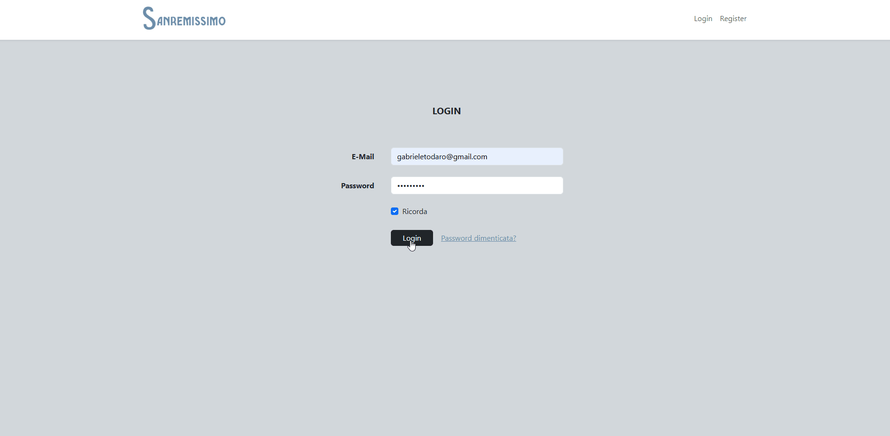
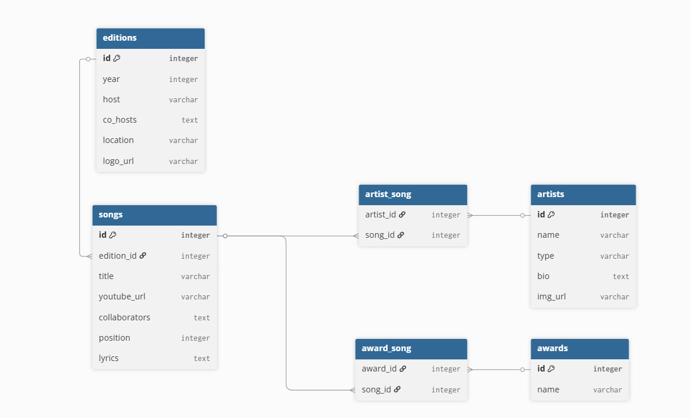

# Sanremissimo Backend API

Il cuore pulsante di Sanremissimo, una piattaforma dedicata alla gestione e consultazione dei dati storici del Festival di Sanremo. Il sistema gestisce la persistenza di edizioni, artisti, canzoni e premi, esponendo endpoint RESTful per permettere al front-end di navigare tra la storia della musica italiana attraverso filtri e relazioni complesse.

### Demo

### Schema DB

### Tecnologie Utilizzate

* **Laravel**
* **MySQL**
* **Eloquent ORM**
* **RESTful API**
* **PHP**
* **CORS Middleware**
